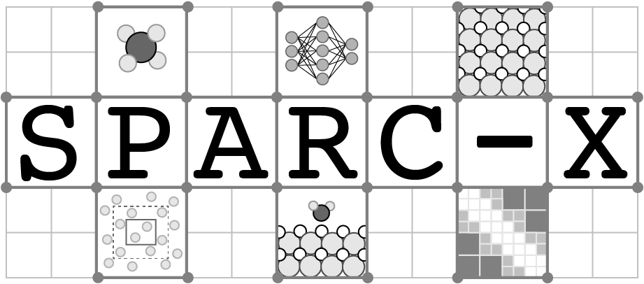

## Introduction

“SPARC-X is a project to develop a density functional theory (DFT) code to conduct Quantum simulations at extreme scale and achieve ab-initio reactive dynamics from first principles. The project will leverage the SPARC finite-difference DFT engine in conjunction with new developments in numerical methods, machine learning, and high-performance computing to produce a software suite capable of operating on emerging exascale machines to perform DFT and molecular dynamics calculations at unprecedented levels of theory for massive numbers of atoms (~10^6) and long timescales (~1 ns). The project combines diverse expertise from the fields of solid-state physics, numerical methods, high-performance computing, catalysis, machine learning, and visualization, and is supported by the DOE Computational Chemical Sciences program (Grant No. ####).”


## Markdown

Markdown is a lightweight and easy-to-use syntax for styling your writing. It includes conventions for

```markdown
Syntax highlighted code block

# Header 1
## Header 2
### Header 3

- Bulleted
- List

1. Numbered
2. List

**Bold** and _Italic_ and `Code` text

[Link](url) and 
```

For more details see [GitHub Flavored Markdown](https://guides.github.com/features/mastering-markdown/).

### Jekyll Themes

Your Pages site will use the layout and styles from the Jekyll theme you have selected in your [repository settings](https://github.com/ray38/webpage_test/settings). The name of this theme is saved in the Jekyll `_config.yml` configuration file.

### Support or Contact

Having trouble with Pages? Check out our [documentation](https://help.github.com/categories/github-pages-basics/) or [contact support](https://github.com/contact) and we’ll help you sort it out.
